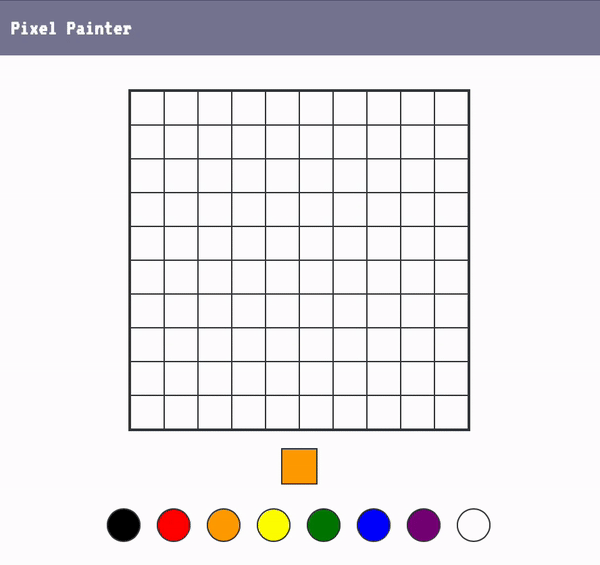
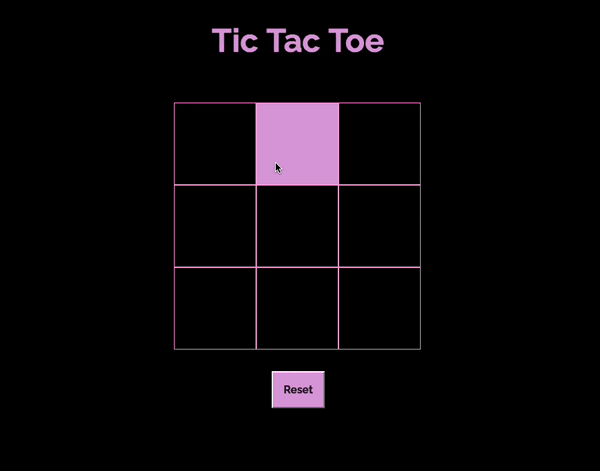

# Events Lab

Now that you know how to work with event listeners, you can build a simple pixel painter in the browser.

---

## Lab Setup

1. Fork and clone this repository.

1. Navigate to the `settings` tab on GitHub, then choose `Pages` from the menu. Configure the `Build and Deployment` to have a `Source` of `Deploy from a branch` and select the `main` branch for deployment. Deployments can take a few minutes, so get started on the lab, and then be sure to check the deployment after you have made a few commits.

1. Open up the repository in VSCode. Follow the instructions below to complete the Lab.

## Instructions

There are two parts to this lab: Pixel Painter and Tic Tac Toe.

### Pixel Painter

You will need to complete the following tasks. If you're unclear about any of the instructions below, reach out to your instructor.

- [ ] When a color is clicked in the `#palette`, the `#current-color` element should have its background changed to that color. For example, if you click the green circle in the `#palette`, the `#current-color` element's background should change to be green.

- [ ] When you click on a `.cell`, its background should change to match the background of `#current-color`.

### Tip

Remember that you can access an elements style declarations by accessing the `.style` property on the individual element. You can also use this to set styles.

### Additional Features

Attempt to implement _at least one_ of the following features:

- [ ] Increase the number of cells without increasing the width or height of the `#canvas` element.
- [ ] Change the event listener so that instead of clicking to fill a color, you hold down your mouse.
- [ ] Create a button that, when clicked, resets all cells so that they all have a background of white.
- [ ] Create a button that, when clicked, changes all of the cells so that they match the `#current-color` element's background.

Feel free to add other fun features to build out your pixel painter!

### Tic Tac Toe

You will need to complete the following tasks. If you're unclear about any of the instructions below, reach out to your instructor.

- [ ] Write a function called `makeBoard()` that will generate 9 `div` with the class `empty` and another class `square`.

- [ ] Call `makeBoard()` on page load so that 9 squares appear and the board is 3 x 3 squares.

- [ ] Write a function called `makeMove()` that is an event handler for the `div`s with the class of `square` that

  - Checks if the clicked square has the class `empty`.
  - If the square has the class empty add either an `X` or an `O` inside the square, remove the class `empty` and write some logic so that the next time this function is called the other player has a play (first play an X then an O, then an X...).
  - Players should NOT be able to change a full square.

- [ ] Add a listener to the reset button and write an event handler function called `reset`, that removes the squares and then calls `makeBoard()` to reset the board.

### Additional Features

Write a function that checks if all the squares are full. If they are, make a pop up that says "Game Over"

Create some game logic that checks if X or O won and create a message displaying who won.
